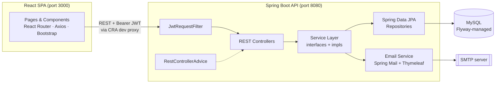
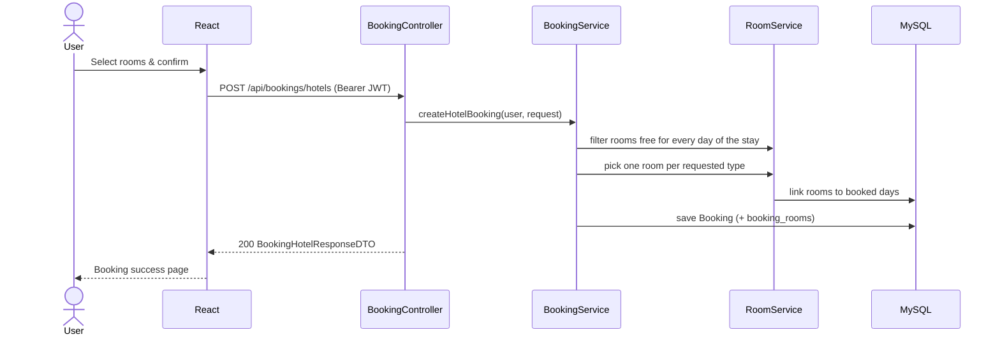
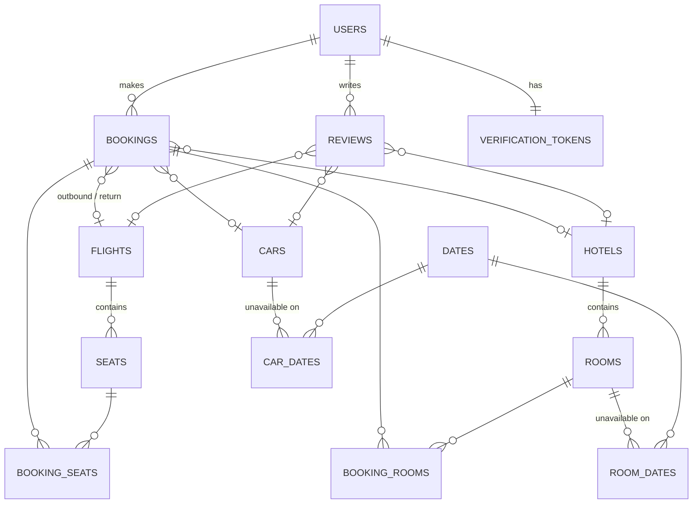

<div align="center">

# ✈️ Booking App

**A full-stack travel booking platform where users can search and book flights, hotels, and rental cars, then review them.**


[Features](#-features) · [Architecture](#-architecture) · [Data Model](#-data-model) · [API](#-rest-api) · [Getting Started](#-getting-started) · [Testing](#-testing)

</div>

---

## 📌 Overview

Booking App is a full-stack web application inspired by platforms like Booking.com. Users register with email verification, log in with a JWT, and then:

- search **one-way or round-trip flights** and pick their **seats** (Economy, Business, First Class),
- search **hotels** by city, dates, and guest count, and book one or more rooms of different types,
- search **rental cars** with the same or a different drop-off location, filtered by car type, capacity, and transmission,
- manage their **profile** and view all their **bookings** in one place,
- leave **reviews** on flights, hotels, and cars.

The backend is a layered **Spring Boot REST API** backed by **MySQL** with **Flyway** migrations. The frontend is a **React 18** single-page app.

## ✨ Features

### 🔐 Authentication & Accounts
- Registration with Bean Validation (required fields, email format, minimum password length) and uniqueness checks for username, email, and phone number
- **Email verification**: a UUID token is generated at signup and emailed as an HTML message (Thymeleaf template, sent via Spring Mail). Login is blocked until the account is verified.
- **Stateless JWT authentication** with a custom `OncePerRequestFilter`. Tokens carry the username, user ID, and expiry and are signed with HMAC-SHA via JJWT.
- Passwords hashed with **BCrypt**
- Profile management: view, update (with duplicate email/phone checks), and delete an account. Deleting an account **releases the seats, rooms, and car dates** it had reserved.

### 🛫 Flights
- One-way search by origin/destination (city name **or** IATA airport code, case-insensitive) and date
- Round-trip search that pairs outbound and return flights in a single native SQL self-join
- Interactive **seat map** with seat classes and per-seat pricing; booked seats are marked unavailable

### 🏨 Hotels
- Search by city, check-in/check-out dates, and number of guests
- Only hotels with rooms free for the **whole stay** are returned, along with available room counts per type (Single, Double, Triple, Family) and the total price for the stay
- Book multiple rooms of different types in one booking
- Room filtering in the UI by type, facilities, and a **price range slider**

### 🚗 Car Rentals
- Same-location or different-location drop-off search
- Optional filters for car type (Small / Medium / Large), seat capacity, and transmission (Manual / Automatic), implemented as nullable parameters in a single native query
- Day-level availability check and a total price based on rental length

### 🧾 Bookings & Reviews
- One polymorphic `bookings` table covers all four booking types (one-way flight, round trip, hotel, car)
- A "My bookings" endpoint returns a typed response for each booking
- Authenticated users can review flights, hotels, and cars; reviews are embedded in search results

### 🛡 Error Handling
- Centralized `@RestControllerAdvice` with **18 custom exceptions**, each mapped to the right HTTP status (400 / 401 / 403 / 404 / 409)
- Consistent JSON error body: `{ "status": "error", "message": "..." }`
- Readable validation messages built from all missing fields at once, e.g. *"FirstName, email and password are required."*

## 🏗 Architecture



The backend is organized **by feature**. Each domain (`booking`, `flight`, `hotel`, `room`, `car`, `seat`, `user`, `review`, `login`, `registration`, `email`, `date`) has its own controllers, DTOs, models, repositories, and services. Every service is defined as an interface with a separate implementation, which keeps the layers loosely coupled and easy to mock in unit tests.

### How availability works

Hotel rooms and cars are reserved **by day**. A `dates` calendar table is generated by a Flyway migration, and rooms and cars link to their booked days through the `room_dates` and `car_dates` join tables. A search expands the requested range into individual days and keeps only the resources that have no overlap. A booking adds those days to the resource, and deleting an account removes them again. Flight seats use a simple `availability` flag instead.

### Booking flow (hotel example)



## 🗄 Data Model



The schema is versioned with **Flyway** (`src/main/resources/db/migration/mysql`), and Hibernate runs with `ddl-auto=validate`, so the migrations are the single source of truth for the schema. Seed migrations load sample flights (with generated seat maps and airport codes), hotels with rooms, cars, and the calendar table.

## 📡 REST API

All `/api/**` endpoints expect an `Authorization: Bearer <token>` header.

### Auth
| Method | Endpoint | Description |
|---|---|---|
| `POST` | `/register` | Create an account and send the verification email |
| `GET` | `/verify?token=` | Activate an account |
| `POST` | `/login` | Returns `{ "token": "<JWT>" }` |

### Flights
| Method | Endpoint | Description |
|---|---|---|
| `GET` | `/api/flights` | Upcoming flights |
| `GET` | `/api/flights/{id}` | Flight details with seats |
| `GET` | `/api/flights/oneWay?origin=&destination=&departureDate=` | One-way search |
| `GET` | `/api/flights/return?origin=&destination=&departureDate=&returnDate=` | Round-trip search |

### Hotels
| Method | Endpoint | Description |
|---|---|---|
| `GET` | `/api/hotels/all` | All hotels |
| `GET` | `/api/hotels?location=&checkInDate=&checkOutDate=&guests=` | Available hotels for a stay |

### Cars
| Method | Endpoint | Description |
|---|---|---|
| `GET` | `/api/cars` | Car list |
| `GET` | `/api/cars/dropOff/same?pickUpLocation=&pickUpDate=&dropOffDate=` | Same-location rental |
| `GET` | `/api/cars/dropOff/different?pickUpLocation=&dropOffLocation=&pickUpDate=&dropOffDate=` | One-way rental |

Optional car filters: `carType`, `capacity`, `transmissionType`.

### Bookings
| Method | Endpoint | Description |
|---|---|---|
| `POST` | `/api/bookings/flights/oneWay` | Book a one-way flight with selected seats |
| `POST` | `/api/bookings/flights/roundTrip` | Book outbound + return flights with seats |
| `POST` | `/api/bookings/hotels` | Book one or more rooms |
| `POST` | `/api/bookings/cars` | Book a car |
| `GET` | `/api/bookings` | All bookings of the logged-in user |

### Users & Reviews
| Method | Endpoint | Description |
|---|---|---|
| `GET` | `/api/users` | Current user's profile |
| `PUT` | `/api/users` | Update profile |
| `DELETE` | `/api/users` | Delete account and release reservations |
| `POST` | `/api/reviews/{flight\|hotel\|car}/{id}` | Add a review |
| `GET` | `/api/reviews/{flight\|hotel\|car}/{id}` | List reviews |

<details>
<summary><b>Example: log in and search flights</b></summary>

```bash
# 1. Log in
curl -X POST http://localhost:8080/login \
  -H "Content-Type: application/json" \
  -d '{"userName":"john","password":"password123"}'
# -> {"token":"eyJhbGciOi..."}

# 2. Search one-way flights (city name or airport code)
curl "http://localhost:8080/api/flights/oneWay?origin=London&destination=Paris&departureDate=2024-07-01" \
  -H "Authorization: Bearer eyJhbGciOi..."
```

Error response example:
```json
{ "status": "error", "message": "Password must have 8 characters." }
```
</details>

## 🖥 Frontend

A React 18 SPA created with Create React App, located in `src/main/frontend`.

| Route | Page |
|---|---|
| `/` | Registration |
| `/verify` | Email verification landing page |
| `/login` | Login |
| `/dashboard` | Home dashboard |
| `/flights` | Flight search (one-way / round trip) |
| `/booking/flights/oneWay`, `/booking/flights/roundTrip` | Seat selection & checkout |
| `/hotels` | Hotel search |
| `/booking/hotels` | Room selection with type, facility & price filters |
| `/cars` | Car search with filters |
| `/profile` | Personal details & booking history with reviews |
| `/booking/success` | Confirmation |

**Libraries:** React Router 6, Axios, Bootstrap 4, Font Awesome, Framer Motion, multi-range-slider-react.
The JWT is stored in `localStorage` and sent as a Bearer header. In development, the CRA proxy forwards API calls to the Spring Boot server on port 8080.

## 🛠 Tech Stack

| Layer | Technologies |
|---|---|
| Language | Java 17, JavaScript (ES6+) |
| Backend | Spring Boot 2.7 (Web, Data JPA, Security, Validation, Mail, Thymeleaf), Lombok |
| Security | Spring Security, JJWT 0.11.5, BCrypt |
| Database | MySQL, Hibernate, Flyway |
| Frontend | React 18, React Router 6, Axios, Bootstrap 4, Framer Motion |
| Testing | JUnit, Mockito, Spring Boot Test, MockMvc |
| Build | Gradle 8.3 (wrapper), npm |

## 🚀 Getting Started

### Prerequisites
- JDK 17
- Node.js 18+ and npm
- MySQL 8 running on `localhost:3306`
- An SMTP account for verification emails (e.g. a Gmail app password)

### 1. Clone
```bash
git clone https://github.com/Oliver9579/Booking-App.git
cd Booking-App
```

### 2. Create the databases
```sql
CREATE DATABASE booking;
CREATE DATABASE booking_test;   -- used by the integration tests
```
Flyway creates the tables and loads the seed data on the first startup.

### 3. Configure
Edit `src/main/resources/application.properties`:

| Property | Description |
|---|---|
| `spring.datasource.url` / `username` / `password` | MySQL connection |
| `jwt.token.secret` | HMAC signing key (long random string) |
| `jwt.expiration.time` | Token lifetime in ms (default `3600000` = 1 hour) |
| `spring.mail.username` / `spring.mail.password` | SMTP credentials for verification emails |

### 4. Run the backend
```bash
./gradlew bootRun
# or build a jar and run it
./gradlew build -x test
java -jar build/libs/Booking-App-0.0.1-SNAPSHOT.jar   # (backend.bat on Windows)
```
The API starts on **http://localhost:8080**.

### 5. Run the frontend
```bash
cd src/main/frontend
npm install
npm start                                            # (frontend.bat on Windows)
```
The app opens on **http://localhost:3000**. Register, click the link in the verification email, and log in.

> 💡 The seed data contains flights from mid-2024, so use 2024 dates when searching flights.

## 🧪 Testing

The project has **130+ tests**, a mix of unit and integration tests:

| Type | What's covered |
|---|---|
| **Integration tests** (`*IT`) | Full HTTP flows with `@SpringBootTest` + `MockMvc` against a MySQL test database seeded by `@Sql`: registration, login, email verification, flights, hotels, cars, bookings, reviews, user profile |
| **Unit tests** | Services with Mockito (`BookingService`, `LoginService`, `RegistrationService`, `EmailService`), `JwtTokenUtil`, `PasswordService`, and the exception handler |

```bash
./gradlew test
```
The integration tests need the `booking_test` database; its connection is configured in `src/test/resources/application.properties`.

## 📂 Project Structure

```
Booking-App
├── build.gradle
├── backend.bat / frontend.bat          # Windows start scripts
└── src
    ├── main
    │   ├── java/com/example/booking
    │   │   ├── booking/                # bookings (flight, hotel, car)
    │   │   ├── car/                    # car search & availability
    │   │   ├── date/                   # calendar days used for availability
    │   │   ├── email/                  # verification tokens & mail sending
    │   │   ├── errorhandling/          # global exception handler
    │   │   ├── exceptions/             # 18 custom exceptions
    │   │   ├── flight/                 # flight search
    │   │   ├── hotel/                  # hotel search
    │   │   ├── login/  registration/   # auth endpoints
    │   │   ├── review/                 # reviews
    │   │   ├── room/  seat/            # bookable units
    │   │   ├── security/               # JWT filter, token util, BCrypt, security config
    │   │   └── user/                   # profile management
    │   ├── resources
    │   │   ├── db/migration/           # Flyway scripts (mysql + test)
    │   │   └── templates/              # Thymeleaf email template
    │   └── frontend/                   # React app
    └── test/java/com/example/booking   # unit & integration tests
```

## 👤 Author

**Oliver**, Java Developer · Spring Boot · React
[GitHub](https://github.com/Oliver9579)
